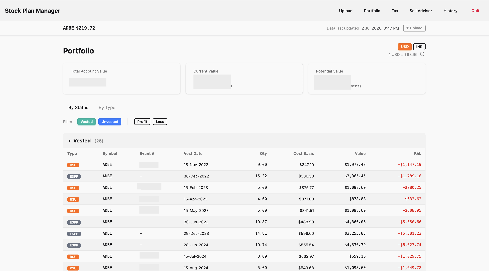
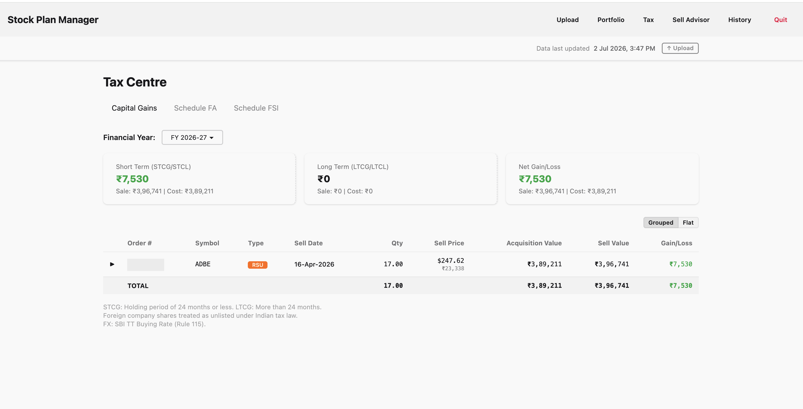
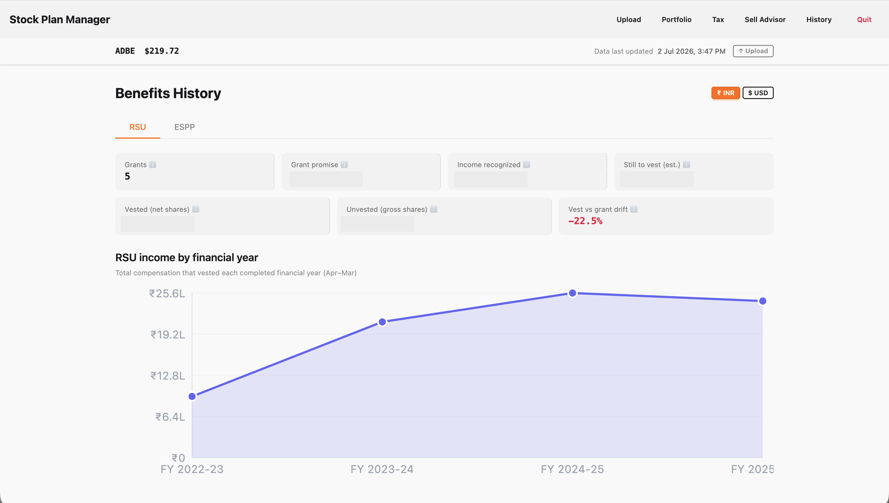
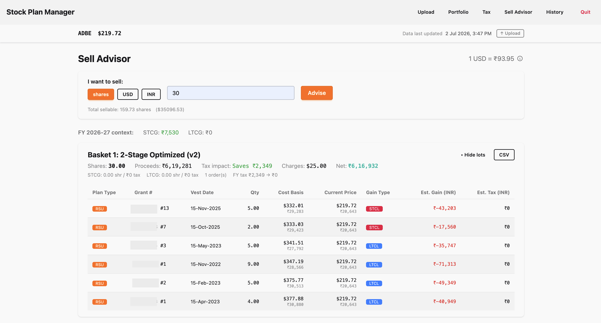

# Stock Plan Manager

A self-hosted, single-tenant app for managing equity compensation — RSU, ESPP, and
Stock Options. Upload your E\*Trade Benefit History, Holdings, and G&L
exports; get a portfolio view, income breakdown, and capital-gains/tax analysis in
**USD + INR**. Runs entirely on your own machine — nothing is uploaded anywhere else.

> **⚠️ Not tax or financial advice.** This tool helps you organize and analyze your
> own equity-compensation data. It does not constitute tax, legal, or financial
> advice, and comes with **no warranty** — see [LICENSE](LICENSE). Always verify
> figures against your broker statements and consult a qualified professional before
> making financial or tax decisions.

## What This Is

- **Single-tenant, self-hosted.** You run your own instance; your data stays on your
  own machine. No accounts, no servers operated by anyone else, no cloud upload.
- **E\*Trade first.** Upload E\*Trade Benefit History (XLSX), Holdings
  (ByBenefitType), and G&L Expanded exports to build a full picture of your
  RSU/ESPP/Stock Option holdings.
- **USD + INR.** Every view (portfolio, income, tax) can toggle between USD and INR,
  using historical and current USD/INR exchange rates.

## Architecture, in one line

Data flows through three layers: **Bronze** (raw, append-only upload archive) →
**Silver** (rebuildable financial truth — grants, vests, exercises, sales) →
**Gold** (derived, rebuildable views — portfolio, income, tax). Re-uploading a file
never loses history; Silver and Gold are always rebuilt fresh from Bronze.

## Screenshots

<!-- Each image below is a real UI screenshot with identifying PII — person names,
     account numbers, and grant/order numbers — redacted, and confirmed by manual
     pixel-review (see D-11/D-12). Per-row and summary dollar/rupee amounts are shown
     as captured (maintainer's accepted disposition; not identifying on their own). -->

| Portfolio | Tax Centre |
|---|---|
|  |  |

| History | Sell Advisor |
|---|---|
|  |  |

## Self-Host Quickstart

Requires Elixir/Erlang (OTP) and Node (for asset tooling). See
[Windows build setup](docs/Windows-build-setup.md) or
[Mac install notes](docs/distribution/README-Mac.md) for packaged/OS-specific
instructions — the steps below are the dev-mode, run-from-source flow.

```bash
mix deps.get
mix ecto.migrate
mix phx.server
```

The app serves on **http://localhost:4002**. On first boot it seeds ~330 months of
USD/INR reference rates automatically (see [FX update process](docs/fx-update-process.md)
for how rates are refreshed). Open the browser to the upload page and add your
E\*Trade exports to get started.

## Learn More

- [LICENSE](LICENSE) — MIT license and warranty disclaimer
- [CONTRIBUTING.md](CONTRIBUTING.md) — how to run tests, format code, and submit changes
- [docs/fx-update-process.md](docs/fx-update-process.md) — how USD/INR reference rates are kept current
